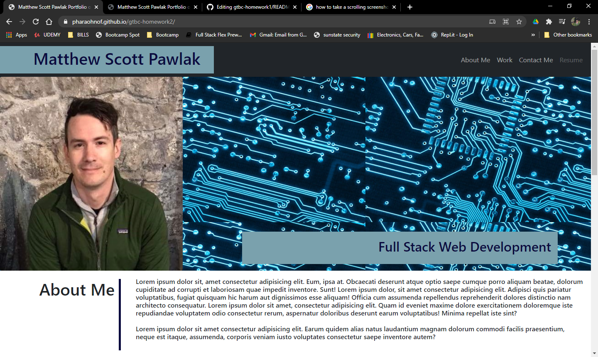
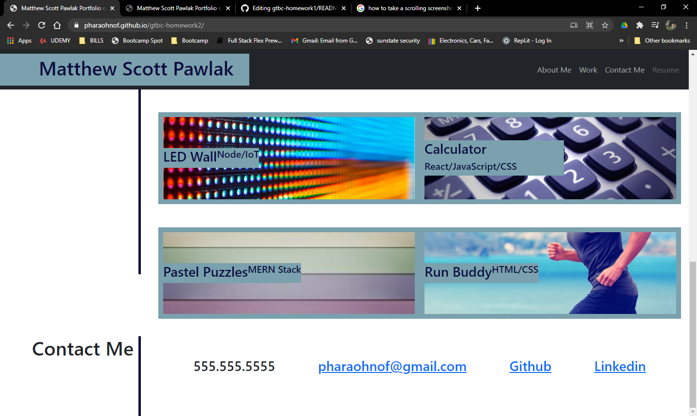
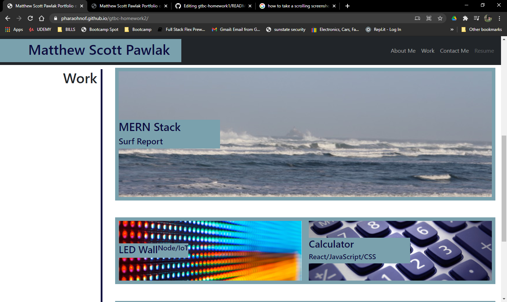

# Portfolio

Georgia Tech Full Stack Bootcamp - Homework 2

This project was a homework assignment for the Georgia Tech Full Stack Bootcamp and involved creating a portfolio webpage. (see full description below)


## Installation

Link to working site: 
 <https://pharaohnof.github.io/gtbc-homework2>

Clone the repository: 
 git clone https://github.com/pharaohnof/gtbc-homework2.git


## Description

 In this project I was given the follwing instructions:


## User Story

```
AS AN employer
I WANT to view a potential employee's deployed portfolio of work samples
SO THAT I can review samples of their work and assess whether they're a good candidate for an open position
```


## Acceptance Criteria

Here are the critical requirements necessary to develop a portfolio that satisfies a typical hiring manager’s needs:

```
GIVEN I need to sample a potential employee's previous work
WHEN I load their portfolio
THEN I am presented with the developer's name, a recent photo, and links to sections about them, their work, and how to contact them
WHEN I click one of the links in the navigation
THEN the UI scrolls to the corresponding section
WHEN I click on the link to the section about their work
THEN the UI scrolls to a section with titled images of the developer's applications
WHEN I am presented with the developer's first application
THEN that application's image should be larger in size than the others
WHEN I click on the images of the applications
THEN I am taken to that deployed application
WHEN I resize the page or view the site on various screens and devices
THEN I am presented with a responsive layout that adapts to my viewport
```


## Mock-Up

The following animation shows the web application's appearance and functionality:


## Result

I made a webpage using HTML, CSS, and Bootstrap. This page includes a floating nav bar which collapses into a hamburger button on shrink. Also inclused active links and contact info. The following screenshot shows the final product:





